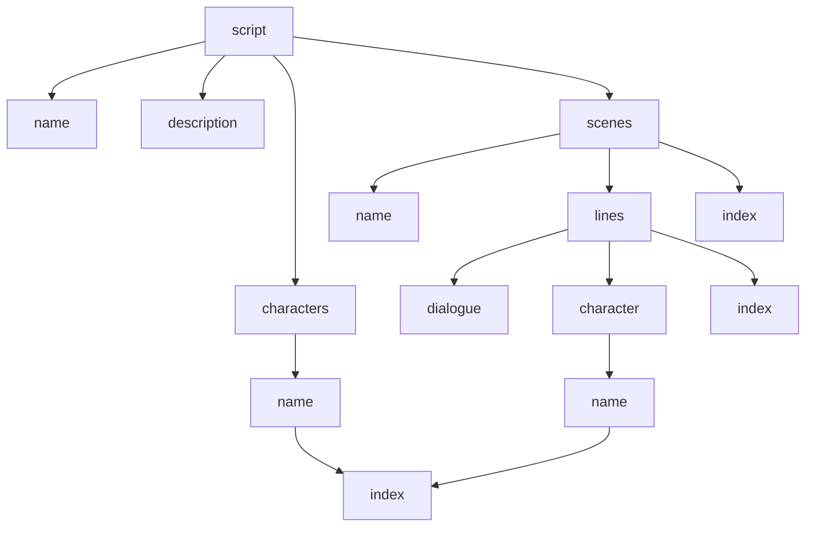

## Software Requirements Specification for 
# PlayRight (Working Title)

## Table of Contents

- [Introduction](#intro)
- [Script Parser](#script)
    - [Accepted Formats](#formats)
    - [Pattern Queries](#pattern)
- [Character Assignment](#char)
- [Positional GUI](#pgui)
- [Acting Annotation](#act)
- [Cue System](#cue)
- [Data Management](#data)
- [Script Syncing](#sync)

## Introduction 

## Script Parser 

### Deconstructing Script Strings 

Before they can be added to our database, scripts need to be broken into their smallest components. This diagram describes the proposed way to deconstruct the script.

Each smaller unit needs to be recorded in relation to the units that contain it.

### Regular Expressions

The easiest way to differentiate different parts of the script will be to use regular expressions. This comes with certain limitations, such as requiring a specific script format, however, such limitations are unavoidable. The regular expressions for each part are:
- Name `/^.*/m`
- Characters `/\b[A-Z][A-Za-z\s]*\b:/g`
- Scene `/SCENE\s+\d+:(.*?)(?=SCENE\s+\d+:|$)/gs`
    - Name `/^SCENE\s+\d+:(.*?)(?=\n)/gm`
- Line `/\b[A-Z][A-Za-z\s]*\b:(.*?)(?=\n[A-Z][A-Za-z\s]*:|$)/g`
    - Character `/\b[A-Z][A-Za-z\s]*\b:/g`
    - Dialogue `/:(.*?)(?=\n|$)/g`

## Character Assignment 

## Positional GUI 

## Acting Annotation 

## Cue System 

## Data Management 

## Script Syncing 
